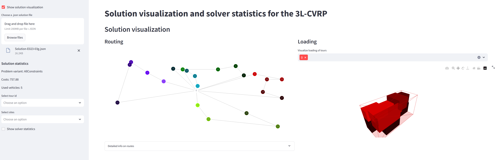
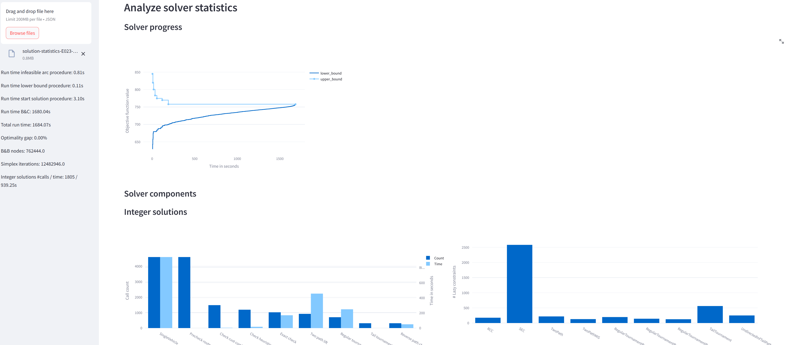

# Vehicle routing problems with three-dimensional loading constraints

This repo is part of the manuscript *A branch-and-cut algorithm for vehicle routing problems with three-dimensional loading constraints*, which is currently under review.

At the moment, the repo only contains the instances, solutions, and a visualizer for the solutions and solver statistics. However, the code of the branch-and-cut algorithm will be added soon.

## Abstract
This paper presents a new branch-and-cut algorithm based on infeasible path elimination for the three-dimensional loading capacitated vehicle routing problem (3L-CVRP) with different loading problem variants. We show that a previously infeasible route can become feasible by adding a new customer if support constraints are enabled in the loading subproblem and call this the incremental feasibility property. Consequently, different infeasible path definitions apply to different 3L-CVRP variants and we introduce several variant-depending lifting steps to strengthen infeasible path inequalities. The loading subproblem is solved exactly using a flexible constraint programming model to determine the feasibility or infeasibility of a route. An extreme point-based packing heuristic is implemented to reduce time-consuming calls to the exact loading algorithm. Furthermore, we integrate a start solution procedure and periodically combine memoized feasible routes in a set-partitioning-based heuristic to generate new upper bounds. A comprehensive computational study, employing well-known benchmark instances, showcases the significant performance improvements achieved through the algorithmic enhancements. Consequently, we not only prove the optimality of many best-known heuristic solutions for the first time but also introduce new optimal and best solutions for a large number of instances.

## Instances
Instances are the classical 3L-CVRP instances introduced in [Gendreau et al. (2006)](https://doi.org/10.1287/trsc.1050.0145). We use only instances with at most 50 customer nodes.

<pre>
.
└── /data/input/3l-cvrp/
    ├── E016-03m.json
    ├── E016-05m.json
    ├── ...
    └── E051-05e.json
</pre>

## Solutions

[Gendreau et al. (2006)](https://doi.org/10.1287/trsc.1050.0145) consider different constraints in the container loading subproblem and introduce the following five variants.

<table class="tg">
<thead>
  <tr>
    <th class="tg-0pky">Variant</th>
    <th class="tg-c3ow" colspan="5">Constraints   </th>
  </tr>
</thead>
<tbody>
  <tr>
    <td class="tg-0pky"></td>
    <td class="tg-0pky">no-overlap</td>
    <td class="tg-0pky">rotation</td>
    <td class="tg-0pky">support</td>
    <td class="tg-0pky">fragility</td>
    <td class="tg-0pky">lifo</td>
  </tr>
  <tr>
    <td class="tg-0pky">all-constraints</td>
    <td class="tg-c3ow">x</td>
    <td class="tg-c3ow">x</td>
    <td class="tg-c3ow">x</td>
    <td class="tg-c3ow">x</td>
    <td class="tg-c3ow">x</td>
  </tr>
  <tr>
    <td class="tg-0pky">no-fragility</td>
    <td class="tg-c3ow">x</td>
    <td class="tg-c3ow">x</td>
    <td class="tg-c3ow">x</td>
    <td class="tg-c3ow"></td>
    <td class="tg-c3ow">x</td>
  </tr>
  <tr>
    <td class="tg-0pky">no-lifo</td>
    <td class="tg-c3ow">x</td>
    <td class="tg-c3ow">x</td>
    <td class="tg-c3ow">x</td>
    <td class="tg-c3ow">x</td>
    <td class="tg-c3ow"></td>
  </tr>
  <tr>
    <td class="tg-0pky">no-support</td>
    <td class="tg-c3ow">x</td>
    <td class="tg-c3ow">x</td>
    <td class="tg-c3ow"></td>
    <td class="tg-c3ow">x</td>
    <td class="tg-c3ow">x</td>
  </tr>
  <tr>
    <td class="tg-0pky">loading-only</td>
    <td class="tg-c3ow">x</td>
    <td class="tg-c3ow">x</td>
    <td class="tg-c3ow"></td>
    <td class="tg-c3ow"></td>
    <td class="tg-c3ow"></td>
  </tr>
</tbody>
</table>
We provide solutions for all variants. In addition, we provide solutions for the one-dimensional approximation (CVRP) of the 3L-CVRP using weight and volume as capacities and solutions for variant all constraints applying a basic variant of the branch-and-cut algorithm (all-constraints-basic). 

<pre>
.
└── /data/output/3l-cvrp/
    └── <em>variant</em>/
        └── <em>name</em>/run-0/
            ├── solution-validator/ # <b> files for <a href="https://github.com/CorinnaKrebs/Visualizer">solution validator</a> </b>
            │   ├── instance-<em>name</em>.txt
            │   └── solution-<em>name</em>.txt
            ├── <em>name</em>.LOG # <b> Gurobi log-file </b>
            ├── solution-<em>name</em>.json
            ├── solution-statistics-<em>name</em>.json
</pre>

## Visualizer
This visualizer is a python app using [Streamlit](https://streamlit.io/). We only provide a visualization of solutions and some solver statistics. The app **cannot** be used to check the feasibility of solutions. If you want to do this, we refer to the paper by  [Krebs & Ehmke (2023)](https://doi.org/10.1007/s10479-023-05238-0) and the accompanying [solution validator](https://github.com/CorinnaKrebs/SolutionValidator) and [visualizer](https://github.com/CorinnaKrebs/Visualizer).

**Disclaimer**: It should be noted that items can hover in our solutions if support constraints are disabled as the supported area can be zero. This is prohibited in [Krebs & Ehmke (2023)](https://doi.org/10.1007/s10479-023-05238-0). Thus, our solutions for variants no-support and loading-only might be infeasible using the solution validator. However, in the case of the loading-only variant, all floating items could be lowered enough to touch an underlying object, resulting in a feasible solution. This is not possible for the no-support variant due to the fragility constraint.

### Requirements
- Python version 3.10 or higher
- Poetry version 1.7.1 or higher, see [official documentation](https://python-poetry.org/docs/)

### Run visualizer locally

1. Clone repository
2. Install dependencies with 
<pre>
poetry install --no-root
or
pip install -r requirements.txt
</pre>
3. Run streamlit web app locally with 
<pre>
streamlit run python/visualization/SolutionVisualizer.py
</pre>

### Solutions
Select a solution file from the output directory, e.g, `data/output/3l-cvrp/all-constraints/e023-03g/run-0/solution-E023-03g.json`.

### Solver information
Select a solution statistics file from the output directory, e.g., `data/output/3l-cvrp/all-constraints/e023-03g/run-0/solution-statistics-E023-03g.json`.

